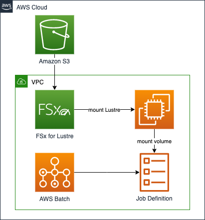

#aws-cdk-fsx-lustre-batch-mount

This [AWS Cloud Development Kit (CDK)](https://aws.amazon.com/cdk/) project deploys an [AWS FSx for Lustre](https://aws.amazon.com/fsx/lustre/) filesystem and mounts it on [AWS Batch](https://aws.amazon.com/batch/) tasks to access S3 data from batch workloads with a shared storage.

>This project builds the solution as described in the AWS Storage blog: [Automatically import Amazon S3 object updates into Amazon FSx for Lustre](https://aws.amazon.com/blogs/storage/automatically-import-amazon-s3-object-updates-into-amazon-fsx-for-lustre/) and combines it with [this Knowledge Center article](https://aws.amazon.com/premiumsupport/knowledge-center/batch-fsx-lustre-file-system-mount/) to integrate it with AWS Batch. 

## Architecture



This CDK project creates an S3 bucket with dummy content and deploys an FSx for Lustre filesystem into a new VPC, as well as AWS Batch resources to run a sample job.
The project includes the following stacks:

- `NetworkingStack`: deploys a VPC with a public subnet, a private subnet, and a NAT Gateway.
- `FSxStack`: deploys the FSx for Lustre filesystem into the VPC and creates an S3 bucket with a few objects for testing.
- `BatchStack`: creates a Launch Template that mounts the FSx filesystem, a Compute Environment that leverages this Launch Template, a job queue that points to the Compute Environment, and a Job Definition that mounts the filesystem into a volume on the container.

## Deploying the stacks

Since all three stacks depend on each other, deploying `BatchStack` will also deploy the other stacks:

```shell
cdk -f --require-approval never deploy BatchStack
```

## Cleanup

```shell
cdk destroy --all
```

## References

This project implements the solutions described in the following articles:

- https://docs.aws.amazon.com/fsx/latest/LustreGuide/create-fs-linked-data-repo.html
- https://aws.amazon.com/blogs/storage/automatically-import-amazon-s3-object-updates-into-amazon-fsx-for-lustre/
- https://aws.amazon.com/premiumsupport/knowledge-center/batch-fsx-lustre-file-system-mount/

## Security

See [CONTRIBUTING](CONTRIBUTING.md#security-issue-notifications) for more information.

## License

This library is licensed under the MIT-0 License. See the LICENSE file.

